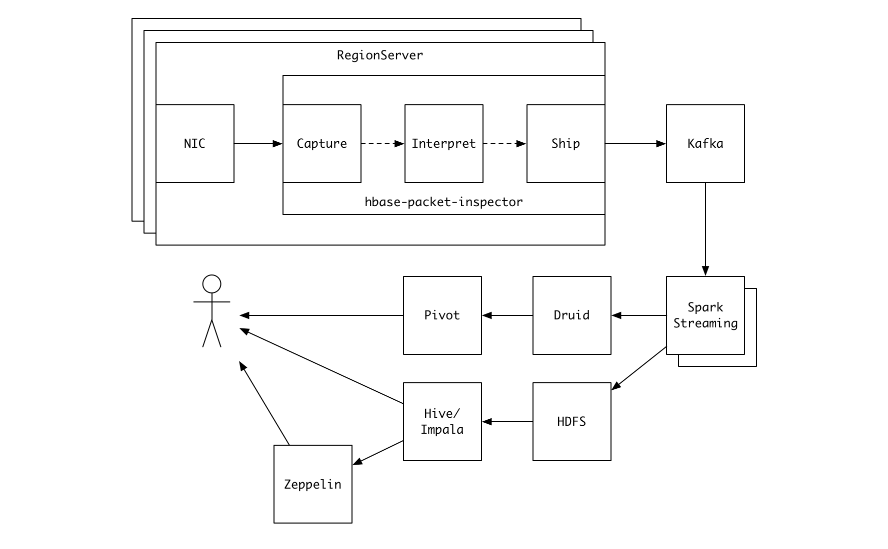
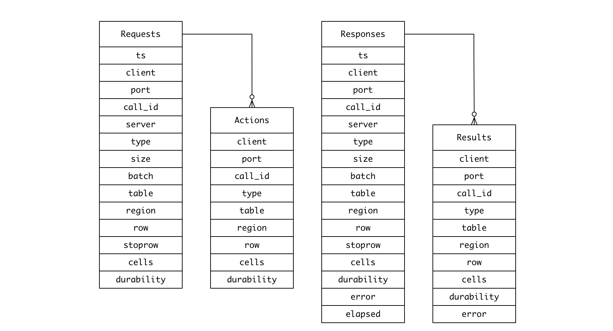

# hbase-packet-inspector

_hbase-packet-inspector_ is a command-line tool for analyzing network traffic
of HBase RegionServers.

It reads tcpdump files or captures live stream of packets of a network
interface to extract the information on client requests and responses.

You can configure it to load the obtained information either to its in-memory
database, which you can access via command-line and web-based SQL interface,
or to a remote Kafka cluster.

## Usage

```
Usage:
  hbase-packet-inspector [OPTIONS] [-i INTERFACE]
  hbase-packet-inspector [OPTIONS] FILES...

Options:
  -h --help                 Show this message
  -i --interface=INTERFACE  Network interface to monitor
  -p --port=PORT            Port to monitor (default: 16020 and 60020)
  -c --count=COUNT          Maximum number of packets to process
  -d --duration=DURATION    Number of seconds to capture packets
  -k --kafka=SERVERS/TOPIC  Kafka bootstrap servers and the name of the topic
                              TOPIC:
                                T      Both requests and responses to T
                                T1/T2  Requests to T1, responses to T2
                                T/     Requests to T, responses are ignored
                                /T     Requests are ignored, responses to T
  -v --verbose              Verbose output
```

When file arguments are not given, hbase-packet-inspector will capture live
stream of packets from a network interface (root permission is required). It
will continue until a specified time has passed (`--duration`), or a certain
number of packets have been processed (`--count`), or the user interrupted it
by pressing enter key. Then it will launch command-line and web-based SQL
interfaces so you can analyze the results using SQL.


### Examples

`hbase-packet-inspector` is an executable JAR file, but you can directly run
it once you set the executable flag.

```sh
# Setting the executable flag
chmod +x hbase-packet-inspector
./hbase-packet-inspector --help

# Reading from tcpdump output
sudo tcpdump -s 0 -c 100000 -nn -w dump.pcap port 16020 or port 60020
./hbase-packet-inspector dump.pcap

# Capturing live stream of packets; continues until you press enter
sudo ./hbase-packet-inspector
```

Alternatively, you can start it with java command to pass extra JVM options.

```sh
java -Xmx2g -jar hbase-packet-inspector --help
```

### Kafka

Since the size of memory is limited, you'll have to interrupt the live capture
at a certain point of time to avoid OOM. But if you want to keep
hbase-packet-inspector alive to monitor the traffic for longer periods of
time, you can make it send records to a remote Kafka cluster in JSON format
instead of building the in-memory database.

```sh
# Both requests and responses are sent to hbase-traffic topic.
# - See boolean "inbound?" field to differentiate two types of records
hbase-packet-inspector --kafka "bootstrap1:9092,bootstrap2:9092/hbase-traffic"

# Requests to hbase-requests, responses to hbase-responses
hbase-packet-inspector --kafka "bootstrap1:9092,bootstrap2:9092/hbase-requests/hbase-responses"

# Only requests to hbase-requests
hbase-packet-inspector --kafka "bootstrap1:9092,bootstrap2:9092/hbase-requests/"

# Only responses to hbase-requests
hbase-packet-inspector --kafka "bootstrap1:9092,bootstrap2:9092//hbase-requests"

# Additional key-value pairs to be included in each record
hbase-packet-inspector --kafka "bootstrap1:9092,bootstrap2:9092/hbase-traffic?service=twitter&cluster=feed"
```

Shipping the information to Kafka has the following benefits:

- Data collection is no longer limited by the size of the physical memory of
  the server.
- You can monitor network traffic of multiple RegionServers at once and get
  a better picture of the cluster activity.
- You can build a sophisticated data pipeline using multiple Kafka consumers
  as shown in the figure below.



## Database schema



### Requests (client requests)

| Column     | Data type | Description                                                      |
| ---------- | --------- | ---------------------------------------------------------------- |
| ts         | timestamp | Event timestamp                                                  |
| client     | varchar   | Client IP address                                                |
| port       | int       | Client port                                                      |
| call_id    | int       | Call ID                                                          |
| server     | varchar   | Server IP address                                                |
| type       | varchar   | Request type (e.g. `get`, `put`, ...)                            |
| size       | int       | Byte size of the request                                         |
| batch      | int       | Number of actions in batch request. Null if not a batch request. |
| table      | varchar   | Table name                                                       |
| region     | varchar   | Encoded region name                                              |
| row        | varchar   | Row key or start row key for a scan                              |
| stoprow    | varchar   | Stop row key for a scan                                          |
| cells      | int       | Number of cells attached                                         |
| durability | varchar   | Durability mode                                                  |

- `row` and `stoprow` columns are stored as human-readable versions of the
  original byte arrays obtained by applying `Bytes.toStringBinary`.
- `call_id` is not globally unique nor monotonically increasing. Join
  between the tables should be performed on [`client`, `port`, `call_id`]
  columns.

### Actions (for multi requests)

A batch/multi request can consist of multiple actions of different types.
Embedded as `actions` array when sent to Kafka as JSON record.

| Column     | Data type | Description              |
| ---------- | --------- | ------------------------ |
| client     | varchar   | Client IP address        |
| port       | int       | Client port              |
| call_id    | int       | Call ID                  |
| type       | varchar   | Request type             |
| table      | varchar   | Table name               |
| region     | varchar   | Encoded region name      |
| row        | varchar   | Row key                  |
| cells      | int       | Number of cells attached |
| durability | varchar   | Duarbility mode          |

### Responses (server response)

Same as `requests`, but with the following additional columns:

| Column  | Data type | Description                   |
| ------- | --------- | ----------------------------- |
| error   | varchar   | Exception. Null if succeeded. |
| elapsed | int       | Elapsed time in millisecond   |

- `elapsed` is measured as the difference between the timestamp of a request
  and that of the matching response.

### Results (for multi responses)

Same as `actions`, but with `error` column. Embedded as `results` array when
sent to Kafka as JSON record.

## Build

```sh
# Requires leiningen
lein bin
```

## Development

### Test

```sh
lein test

# For coverage report, use lein-cloverage (https://github.com/cloverage/cloverage)
lein cloverage
```

#### Generating fixtures

Some of the test cases read actual tcpdump output files for a predefined
series of HBase client operations. They were generated by running
[generate-fixtures.sh](/dev-resources/generate-fixtures.sh) inside Docker
container built with the included [Dockerfile](Dockerfile).

```sh
(cd dev-resources/load-generator && lein uberjar)
docker build -t hpi-test-env .
docker run -v $(PWD)/dev-resources:/data -it hpi-test-env /data/generate-fixtures.sh
```

### Testing functions on REPL

Familiarize yourself with the way hbase-packet-inspector works by trying out
the following snippet on Clojure REPL (`lein repl`).

```clojure
(ns user
  (:require [hbase-packet-inspector.core :as core]
            [hbase-packet-inspector.sink.db :as db]
            [hbase-packet-inspector.sink.kafka :as kafka]
            [clojure.java.io :as io]
            [clojure.tools.logging :as log]
            [clojure.java.jdbc :as jdbc]))

;;; Log records parsed from tcpdump output file
(core/read-pcap-file
 (.getPath (io/resource "scan.pcap"))
 #(log/info %)
 {:port 16201})

;;; Load records into H2 in-memory database
(def connection
  (doto (db/connect) db/create))

(let [[load close] (db/load-and-close-fn connection)]
  (core/read-pcap-file
    (.getPath (io/resource "scan.pcap"))
    load
    {:port 16201})
  (close))

(jdbc/query {:connection connection} "select count(*) from requests")

;;; See how records are sent to Kafka
(core/read-pcap-file
  (.getPath (io/resource "randomRead.pcap"))
  #(log/info (.value (kafka/make-record "hbase-packets" %)))
  {:port 16201})
```

## Caveats

- If the rate of the packet stream exceeds the processing capacity of
  hbase-packet-inspector, packets will be dropped, and it will not be able to
  capture the precise statistics of the workload.
- Please be aware that hbase-packet-inspector uses CPU for processing and
  interpreting the packet stream, and it may affect the performance of the
  RegionServer if it's already heavily loaded.
    - hbase-packet-inspector will occupy up to `2 + min(2, floor(TOTAL_NUMBER_OF_CORES / 4))` cores

## License

This software is licensed under the [Apache 2 license](LICENSE.txt), quoted below.

Copyright 2017 Kakao Corp. <http://www.kakaocorp.com>

Licensed under the Apache License, Version 2.0 (the "License"); you may not
use this project except in compliance with the License. You may obtain a copy
of the License at http://www.apache.org/licenses/LICENSE-2.0.

Unless required by applicable law or agreed to in writing, software
distributed under the License is distributed on an "AS IS" BASIS, WITHOUT
WARRANTIES OR CONDITIONS OF ANY KIND, either express or implied. See the
License for the specific language governing permissions and limitations under
the License.
